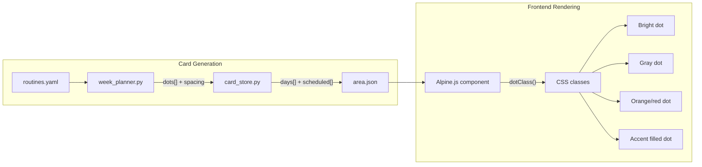

# Routine Card Improvements

## Problem Summary

1. **Scheduling clusters consecutive days** -- Shower (freq=4) might land Mon/Tue/Wed/Fri instead of Mon/Wed/Fri/Sun. The greedy load-balancer doesn't enforce even spacing within a single task.
2. **Unscheduled days are invisible** -- If Shower isn't planned for Tuesday, `days[1] = []` so no dot renders and there's no way to log it if you did it anyway.
3. **No overdue indication** -- A missed scheduled dot looks identical to a future one.

## Changes

### 1. Even-spacing scheduler (`services/week_planner.py`)

Replace the current `_schedule_periodic_global` greedy approach with a **spacing-first** algorithm:

- For each task with `_count` dots to place, compute `ideal_gap = 7 / _count`
- Generate candidate placements spaced at `round(i * ideal_gap) % 7` for `i in 0.._count-1`
- Score candidates against the global `day_loads` to pick the best offset/rotation
- This guarantees Shower(4) gets ~every-other-day (gaps of 2,2,2,1) instead of clustering

Current code to replace in [week_planner.py](life-manager/services/week_planner.py) (the `_schedule_periodic_global` function, lines ~75-105):

```python
# Current: greedy pick lowest-load day each iteration
# Problem: only tie-breaks on distance, doesn't enforce spacing
for _ in range(count):
    available = [d for d in range(7) if dots[d] == 0]
    min_load = min(day_loads[d] for d in available)
    candidates = [d for d in available if day_loads[d] == min_load]
    # ...
```

New approach: pre-compute the full placement pattern per task, then commit.

### 2. Always-interactable days with `scheduled` metadata

**Data model change** -- Add a `scheduled` array to each task in the card JSON:

```json
{
  "name": "Shower",
  "freq": 4,
  "days": [[false],[false],[false],[false],[false],[false],[false]],
  "scheduled": [1, 0, 1, 0, 1, 0, 1]
}
```

- `days[d]` always has `max(original_dots, 1)` booleans (at least 1 per day, always clickable)
- `scheduled[d]` = the planner's original dot count for that day (0 means unscheduled)
- A dot at index `doi` is "scheduled" if `doi < scheduled[d]`, otherwise it's a bonus/unscheduled dot

**Files to change:**

- [card_store.py](life-manager/services/card_store.py) `_generate_routine_cards` -- store `scheduled` per task, ensure `days[d]` always has at least 1 entry
- [cards.html](life-manager/templates/cards.html) -- add `:class` logic using `task.scheduled[di]` to distinguish scheduled vs unscheduled dots
- [app.js](life-manager/static/js/app.js) -- update `cardProgress()` to only count scheduled dots toward the progress percentage; update `toggleDot` to handle the new always-present dots; add new API call when toggling an unscheduled dot (may need to expand the `days` array server-side)
- [style.css](life-manager/static/css/style.css) -- add `.dot.unscheduled` style (dimmed gray border, transparent fill) and `.dot.unscheduled.filled` (colored but at lower opacity)

**Backward compatibility** -- When loading old cards without `scheduled`, treat every non-empty day as fully scheduled: `scheduled[d] = len(days[d])`.

### 3. Overdue dot coloring

A dot is **overdue** when all three conditions are true:
- The day index `di` is before today's day-of-week within this card's week
- The dot is scheduled (`doi < task.scheduled[di]`)
- The dot is not filled (`false`)

**Implementation:**

- [app.js](life-manager/static/js/app.js) -- compute `todayIdx` (0-6) from `card.week_start` vs current date. Add a helper `dotClass(task, di, doi)` that returns the appropriate CSS class string.
- [cards.html](life-manager/templates/cards.html) -- use `:class="dotClass(task, ti, di, doi)"` instead of the current inline `:class`.
- [style.css](life-manager/static/css/style.css) -- add overdue styles:
  - `.dot.overdue-1` (1 day late): light orange border/background tint
  - `.dot.overdue-2`: medium orange
  - `.dot.overdue-3`: dark orange
  - `.dot.overdue-4` and beyond: red
  - These only apply to unfilled dots; filled dots stay the normal accent color

### 4. Delete stale card data

Since the `scheduled` field is new and the scheduling algorithm is changing, delete the existing `data/routine-cards/` contents so fresh cards regenerate with the new structure.

## Data flow


